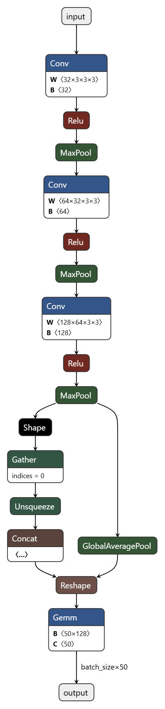
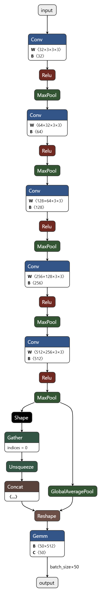
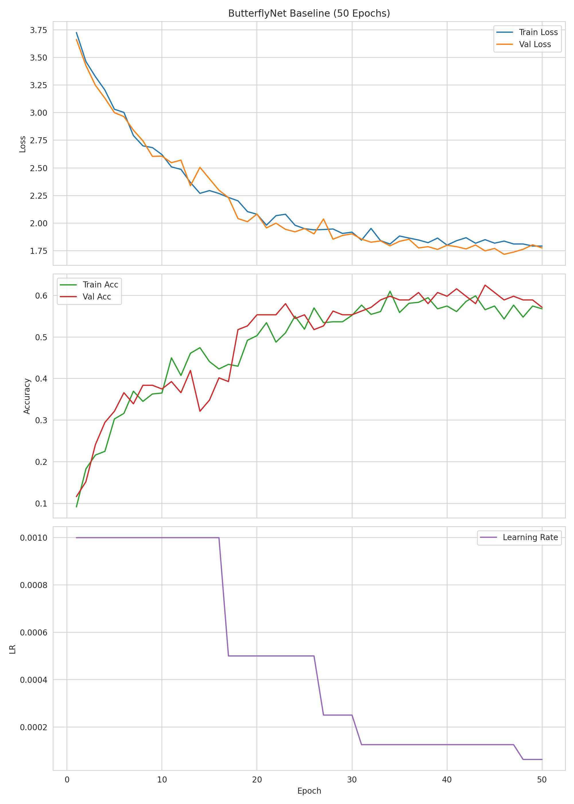
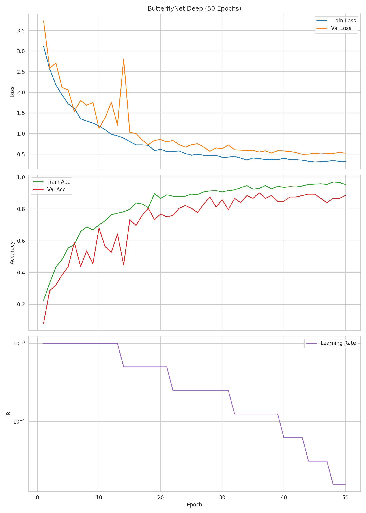
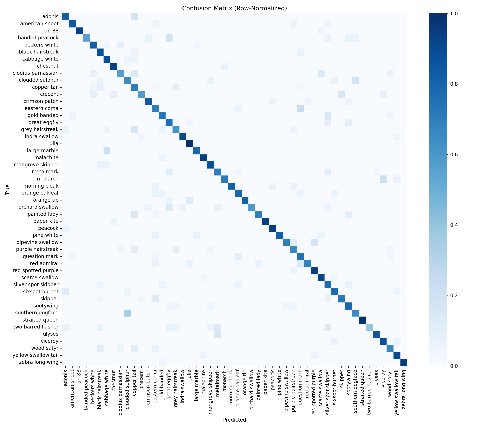
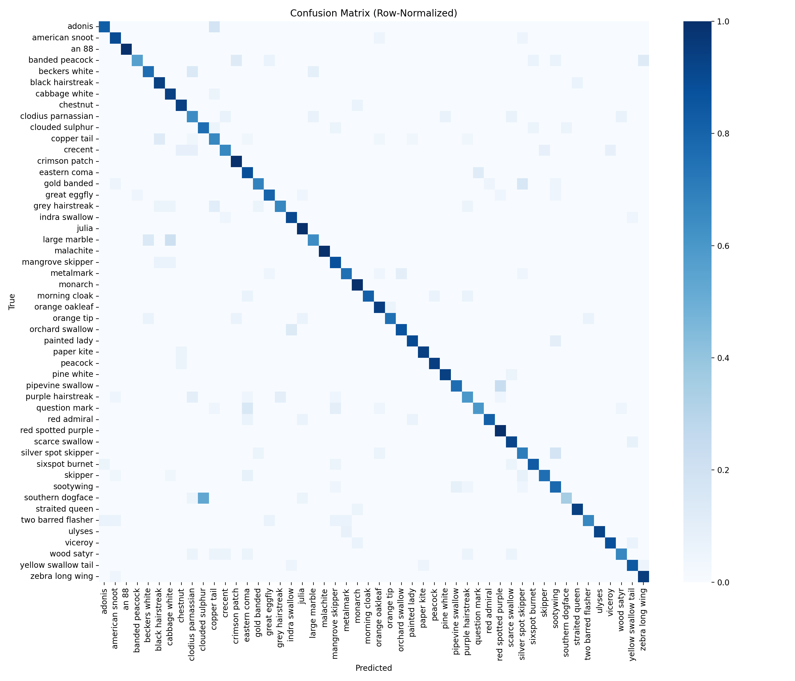

# ButterflyNet开发
## 深度学习框架选取
本项目选用 PyTorch 作为深度学习框架，使用torchrun进行方便的多卡分布式训练。

## 卷积神经网络模型设计
设计了两个版本的模型，baseline和deep。后续会阐释为什么设计了两个版本。
### baseline

### deep

### 模型设计思路
- ConvBlock 设计：每个卷积块采用 `Conv2d(3x3, stride=1, padding=1) + BatchNorm2d + ReLU + MaxPool2d(2)`。
    - 理由：3x3 保持局部感受野平滑增长；BN 稳定训练、允许更大学习率；MaxPool 简洁直观、推理高效。
- 层数与通道安排：
    - Baseline：3 个块，通道数依次为 32 → 64 → 128。输入 224x224 经每块的池化依次变为 112 → 56 → 28；感受野与语义层次逐步增强，最终得到 128x28x28。
    - Deep：5 个块，通道数 32 → 64 → 128 → 256 → 512。空间分辨率 224 → 112 → 56 → 28 → 14 → 7；更大的感受野与表达力，适合细粒纹理与伪装形态的区分。
- GAP 层与分类头：在卷积层之后使用 `AdaptiveAvgPool2d(1x1)` 得到通道维度的全局平均（Baseline 得到 128，Deep 得到 512），再接 `Linear(C, 50)` 输出 logits。
    - 理由：GAP 可以显著降低参数量，提升平移不变性与稳健性；对不同输入尺寸具备自适应能力，利于部署。
- 正则化与可选模块：
    - 默认启用 BN；可按实验切换 `Dropout(p)` 于 GAP 后、分类层前（已在训练脚本中支持 `--dropout_p`）。
    - 数据增强（水平翻转/旋转/色彩扰动）等在数据预处理管道中实现，可选是否开启。
- 设计取舍：
    - 选择 MaxPool 而非 stride=2 卷积，优先可读性与对比基线的简洁；后续可替换观察精度与速度权衡。
    - ReLU 简洁稳定；可在改进阶段尝试 SiLU/GELU 等以评估收益。
- 可解释性友好：最后一个卷积层的特征图与梯度用于 Grad-CAM，观察模型在翅膀纹理/边缘/背景处的关注区域；GAP 设计便于热力图与决策的对应理解。


## 训练

### 优化器选择

- 选择 Adam（lr=1e-3, betas=(0.9, 0.999)）：对初期学习率更鲁棒、收敛稳定，便于快速迭代；与中小型 CNN 配合良好。
- 学习率调度：ReduceLROnPlateau（监控 `val_acc`，factor=0.5，patience=3，min_lr≈1e-8）。
    - 现象：当验证精度停滞时自动减小 LR，曲线呈台阶式下降并伴随小幅精度提升（见曲线图）。
    - 优点：可减缓中后期震荡与过拟合迹象。

### 超参数设置

- 输入与预处理：
    - 输入尺寸：224×224；Normalize 使用 `src/data/dataset_stats.json` 的 mean/std。
    - 训练增强：默认关闭；按实验开启 simple/full 两类增强以做对比。
- 训练配置：
    - Epochs：50（baseline/deep 均使用）。
    - Batch size：32（依据显存可调）；`num_workers` 建议 4–8；`pin_memory=True`（CUDA）。
    - 优化器：Adam(lr=1e-3, betas=(0.9,0.999))，可选 `weight_decay=1e-4` 做轻度正则。
    - 学习率调度：ReduceLROnPlateau(val_acc, factor=0.5, patience=3, min_lr≈1e-8)。
    - 随机数种子：42（random/NumPy/torch/cuda 同步设置，保证复现）。
- 分布式训练：
    - 多卡训练使用 `torchrun`（DDP）。
    - 检查点：按 `val_acc` 保存最佳；历史曲线写入 `checkpoints/history_*.json` 便于复盘与作图。

### 训练结果
下图为两次训练记录的曲线可视化（Loss/Accuracy/LR）。

Baseline（50 epochs）


- Baseline观察：
    - 收敛过程平稳，Val Acc 约在 epoch 44 达到峰值≈0.625，Train/Val 曲线间隔较小，未出现明显过拟合。
    - 多次 plateau 后触发 LR 下调（见 LR 子图台阶），随后验证集精度小幅提升；说明 ReduceLROnPlateau 生效但提升空间有限。
    - 结论：网络容量可能偏小，正则化（如引入 Dropout）的收益预期有限。

Deep（50 epochs）


- Deep 观察：
    - 训练精度快速上升（<20 个 epoch 即>0.85，后期>0.95），验证集在 LR 首次下降后显著提升，峰值 Val Acc 达到≈0.90——0.91 区间。
    - 中后期 Train/Val 间出现更明显间隔，Val Loss 偶有回升（如 epoch 31 附近），提示过拟合趋势；LR 台阶后指标恢复，说明LR调度对训练稳定性十分重要。
    - 结论：更深模型表达力更强但过拟合风险更高，应配合 Dropout、数据增强与更温和的 LR 调度以提升鲁棒性。

## 测试
本项目的测试评估采用多维度指标，而非单一 Accuracy，原因在于：
1. 多类别（50类）且类别样本数存在轻度不均衡（support 在 12~25 之间浮动），单纯 Accuracy 容易掩盖少数类别劣势。
2. 需要识别改进策略（加深网络、加入 Dropout）是否同时提升整体与尾部类别性能，因此需要分解为 Precision/Recall/F1 与混淆矩阵来定位易混淆类。

具体指标与选择理由：
- Top-1 Accuracy：整体正确率，衡量最终分类任务基本达成度；任务要求必须提供。
- Weighted Precision / Recall / F1：按每类 support 加权，避免多数类主导；F1 综合兼顾精确率与召回率，能反映在提升 Recall 时是否牺牲 Precision。
- Per-Class Precision / Recall / F1：用于定位具体困难类别（例如 baseline 中出现若干 Recall≈0 的类别）。
- Confusion Matrix：展示错分走向，分析哪些类别对（例如相似纹理或背景）互相混淆，为后续增强与正则策略提供依据。
- Support（每类样本数）：便于在报告中解释某些极端值（某些类样本少导致统计波动大）。

未采用（但有评估过）的其他指标说明：
- Macro F1：各类平均不加权；由于类间样本差异不算极端，宏平均与加权平均趋势基本一致，故报告以加权数值为主并保留 per-class 明细即可。
- Top-5 Accuracy：适用于细粒度分类但部署侧（推理直接给出单一结果）不需要候选列表，故未纳入主体结果。

评价流程：对验证集（894 张）运行推理，聚合 logits 取 argmax 生成预测；调用自定义 metrics 聚合函数（封装 sklearn.metrics.classification_report 的加权部分，并单独处理 support）输出 JSON 与可视化图片供分析（见 `analysis/metrics/*` 与 `analysis/figures/confusion_matrix_*.png`）。

指标解读要点：
- 若 Weighted Precision 明显高于 Weighted Recall，说明模型对少数类存在保守预测倾向；若二者接近则决策较平衡。
- F1 与 Accuracy 差距较大时（baseline），意味着正类分布不均或某些类预测失衡；深模型中 F1≈Accuracy 表示整体与加权类别性能趋于一致，泛化更均衡。

## 测试结果
下表汇总 baseline 与 deep 最优检查点的验证集指标（不含 Dropout 与增强对比，增强与正则放在后续改进章节）：

| Variant | Accuracy | Weighted Precision | Weighted Recall | Weighted F1 |
|---------|----------|--------------------|-----------------|-------------|
| Baseline | 0.5190 | 0.5271 | 0.5190 | 0.4913 |
| Deep     | 0.7975 | 0.8139 | 0.7975 | 0.7986 |

改进幅度（Deep 相对 Baseline）：
- Accuracy：+0.2785（绝对），约 +53.7% 相对提升。
- Weighted F1：+0.3073（绝对），约 +62.6% 相对提升。

现象与原因分析：
1. 深层网络引入更多通道（最终 512 vs 128）与更深感受野，提升了细粒纹理与局部形状的区分能力——混淆矩阵中大量零行被填充，低 Recall 类显著减少。
2. F1 与 Accuracy 在 deep 版本上趋同（≈0.80），说明 Precision 与 Recall 更加平衡；baseline 存在若干 Recall=0 或接近 0 的类别导致加权 F1 拉低。
3. Deep 模型仍出现过拟合迹象（训练精度接近饱和而部分验证类波动），为后续加入 Dropout 提供动机。
4. 少数类的 Recall（support 较低的类）在 deep 版本中多数提升，但个别仍偏低（例如某些背景噪声高的类），指向数据增强与可解释性分析（Grad-CAM）必要性。

结论：更深结构是提升蝴蝶多分类性能的主要驱动；后续需用适度正则（Dropout）与增强进一步抑制过拟合并提升尾部类别表现。

## 尝试改进

### 引入dropout
动机与假设：
- Baseline 训练曲线显示无明显过拟合（Train/Val 精度间隔小），因此额外随机失活可能造成“欠拟合”与性能下降。
- Deep 模型出现 Train 精度快速趋近饱和而 Val 精度阶段性停滞的现象，提示一定过拟合；引入适度 Dropout 期望提升泛化。

实验配置：在 GAP 后、Linear 前添加 Dropout，分别测试：
- Baseline：p=0（无）、p=0.30（初始尝试）、性能下降后改为 p=0.05（弱正则）。
- Deep：p=0（无）、p=0.20（适度）。

指标对比（验证集）：
| Variant | Dropout p | Accuracy | Weighted Precision | Weighted Recall | Weighted F1 |
|---------|-----------|----------|--------------------|-----------------|-------------|
| Baseline | 0.00 | 0.5190 | 0.5271 | 0.5190 | 0.4913 |
| Baseline | 0.30 | 0.4821 | 0.4996 | 0.4821 | 0.4485 |
| Baseline | 0.05 | 0.5045 | 0.5321 | 0.5045 | 0.4805 |
| Deep     | 0.00 | 0.7975 | 0.8139 | 0.7975 | 0.7986 |
| Deep     | 0.10 | 0.7875 | 0.8110 | 0.7875 | 0.7897 |
| Deep     | 0.20 | 0.8166 | 0.8340 | 0.8166 | 0.8164 |
| Deep     | 0.30 | 0.7673 | 0.8026 | 0.7673 | 0.7702 |

Baseline 分析：
1. p=0.30 显著降低所有指标（Accuracy -3.7 个百分点，F1 -4.28 个百分点），验证“未过拟合+强正则 → 欠拟合”。
2. 降低到 p=0.05 后 Accuracy 仍低于无 Dropout（0.5045 < 0.5190），但 Weighted Precision 略高（0.5321 > 0.5271），说明少数类部分预测更谨慎，然而 Recall 未提升导致 F1 仍下降。
3. 混淆矩阵（见 `confusion_matrix_baseline_drop0.30_*` 与 `confusion_matrix_baseline_drop0.05_*`）中原本已正确的高支持类出现更多分散到相似类的错分；少数低支持类仍存在全零或极低命中。
4. 结论：baseline 不应启用 Dropout（或需更小 p 与更长训练才能弥补损失）。

Deep 分析：
1. p=0.10 较无 Dropout 略降（Acc 0.7975→0.7875、F1 0.7986→0.7897），说明轻度失活未有效抑制过拟合，反而引入噪声。
2. p=0.20 明显最优（Acc +1.91 个百分点、F1 +1.79 个百分点），泛化改善稳定，Precision/Recall 同步提升（0.8139→0.8340，0.7975→0.8166）。
3. p=0.30 过强导致明显退化（Acc 0.7673、F1 0.7702），模型容量受限，主对角密度下降、错分增加。
4. 结论：存在近似 U 形关系，p≈0.20 为当前设置下的较优点；若要继续优化，应该在 [0.15, 0.25] 做更细粒度搜索，并与数据增强/训练时长联动调参。

混淆矩阵对比（Deep）：

Deep（p=0.00）


Deep（p=0.20）


结合观察：
- 主对角线更“亮”：p=0.20 时，多数类别的真阳性计数进一步集中，表明整体 Recall 提升具备广泛性，而非个别类别偶然波动。
- 典型错分减轻：若干中等 support 类（约 14–17 张）的误判从相邻纹理相似的类别回落到本类，列向“塌缩”现象缓和，说明 Dropout 对过拟合的抑制降低了对高频类的偏置。
- 长尾改善但仍不稳定：少数低支持类在 p=0.20 下出现明显增益，但在背景复杂或轮廓相近类别上仍有分散错分，后续需配合数据增强与更细粒度调参。

补充对比（p=0.10 与 p=0.30）：

Deep（p=0.10）


Deep（p=0.30）


简要点评：
- p=0.10：相较 p=0.00，对角线略有削弱，部分中等支持类（support≈14–17）出现更多向相邻类的错分，和整体指标小幅回落一致，呈轻度欠拟合倾向。
- p=0.30：对角线明显变暗、非对角元素增多，错分更分散，说明过强正则显著限制了表征能力，与 Accuracy/F1 明显下降相吻合。

结论：
- Baseline：不使用 Dropout（保持容量最大化），若后续添加更激进增强可再重新评估。
- Deep：保留 p≈0.20 的 Dropout 作为默认正则；在改进阶段配合数据增强与学习率微调进一步提升尾部类别稳定性。

### 引入数据增强

动机与目标：缓解深模型的过拟合与对背景/光照/姿态的敏感性，通过在训练期进行随机扰动来提升泛化，尤其关注验证集长尾类别（support 较低）的 Recall 与整体 F1。

增强配置说明：
- Simple：轻量级几何与颜色扰动（如随机水平翻转、小角度旋转/平移与轻微颜色扰动），保持样本语义与结构基本不变。
- Full：更强的空间与颜色变换组合（例如更大的旋转/尺度抖动与更显著的颜色抖动），进一步提升鲁棒性但存在引入训练噪声的风险。

实现方法：详见`src/data/transforms.py`。

评测对象：Deep 模型（不含 Dropout）在三种设置上的对比——无增强（No-Aug）、Aug-Simple、Aug-Full。

指标对比（验证集）：

| Variant | Accuracy | Weighted Precision | Weighted Recall | Weighted F1 |
|---------|----------|--------------------|-----------------|-------------|
| Deep (No-Aug)  | 0.7975 | 0.8139 | 0.7975 | 0.7986 |
| Deep + Aug-Simple | 0.8188 | 0.8312 | 0.8188 | 0.8167 |
| Deep + Aug-Full   | 0.8154 | 0.8323 | 0.8154 | 0.8142 |

关键结论：
- 整体提升：两种增强均优于无增强。Aug-Simple 的 Accuracy/F1 略高于 Aug-Full（Acc +2.13/+1.79 个百分点；F1 +1.81/+1.56 个百分点，相对 No-Aug），而 Aug-Full 的加权 Precision 略占优（0.8323 > 0.8312）。
- 泛化均衡性：Aug-Simple 使 Accuracy 与 F1 的提升更为一致，表明在不显著引入噪声的前提下提升了多类整体表现；Aug-Full 略偏向 Precision 的提升，说明更强扰动下模型预测更“谨慎”。
- 代价与收益：在当前数据量与训练时长下，Aug-Simple 提供了更好的收益-风险平衡；Aug-Full 仍明显优于 No-Aug，但在部分中小样本类上可能引入轻微欠拟合迹象。

混淆矩阵（Deep）：

Deep（No-Aug）


Deep + Aug-Simple


Deep + Aug-Full


观察与解读：
- 主对角线更密集：两种增强均明显增加主对角命中，错分向相邻纹理相似类别的“外溢”减少，验证集整体 Recall 提升。
- 长尾类别改善：Aug-Simple 下若干低支持类的零召回被修复（对角线出现有效命中），Aug-Full 的改善幅度接近但个别类出现轻微分散。
- 误差结构变化：Aug-Full 在若干背景复杂或颜色差异大的类别上显示更强的颜色/光照鲁棒性（列分布更均衡），但对形状细节非常敏感的小类偶有“过扰动”导致的错分。

结论：
- 将 Aug-Simple 作为默认增强策略，优先获取稳定收益；在需要更高鲁棒性（背景/光照变化大）场景下再切换 Aug-Full。
- 与前述 Dropout p≈0.20 的配置建议组合做小范围网格搜索（如 Aug-Simple × p∈[0.15, 0.25]），以验证二者协同作用对长尾类别的进一步提升。

## 遇到的问题与解决方案

1. 硬件层报错：Floating Point Exception：
    这是由于旧版本CUBLAS不支持H20显卡架构导致的。把nvidia-cublas-cu12升级到12.4.5.8版本即可。
    ```bash
    pip install nvidia-cublas-cu12==12.4.5.8
    ```

2. `ButterflyNet/evaluate.py", line 93, in compute_metrics "support_total": int(sum(support)), TypeError: 'NoneType' object is not iterable`: 
    修改`compute_metrics`：分离加权与逐类调用，避免 `support=None` 导致的 `sum(support)` 异常。